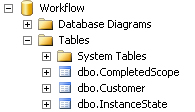
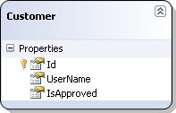
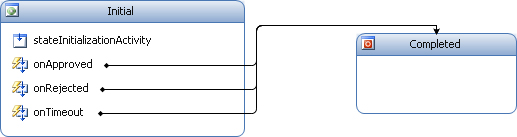
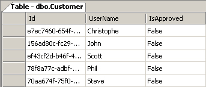
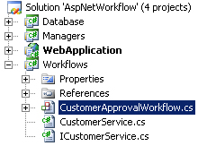
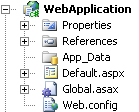
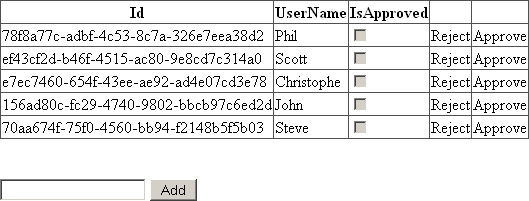

# Windows Workflow in ASP.NET

## Introduction

This article quickly details the steps you need to perform in order to enable support for the Windows Workflow Foundation (WF) in ASP.NET (classic or MVC). Let's use a very small demo application to show you how you can do this.

Integrating WF in ASP.NET is something I had to do in the last few projects I worked on. So I thought I'd build a small sample application that shows you the bare minimum of code required in order to achieve this. Let's build a sample application step by step...

**Remark**: This article is not a primer on WF. Some basic understanding of WF is required.

## Database

Start up SQL Server Management Studio and create a new database called "Workflow". You need to create a few tables and logic (stored procedures and such) in order to support persistence for WF. In the directory "C:\\WINDOWS\\Microsoft.NET\\Framework\\v3.0\\Windows Workflow Foundation\\SQL\\EN" you'll find 4 SQL files. Execute the following two in this order:

- SqlPersistenceService_Schema.sql
- SqlPersistenceService_Logic.sql

This creates two tables and 10 stored procedures that are required in order to support persistence for WF in an SQL Server database. Now download the source code for this article, extract it and execute the DDL.sql script. This script creates one table called Customer.

You should wind up with a database structure that looks like this:

**Figure 1** - Workflow database



When you open the sample solution of this article you'll find one code library project called "Database". All it contains is a LINQ To SQL classes file which contains one entity, namely Customer.

**Figure 2** - Customer Entity



## Customer Approval Workflow

The sample application allows you to create customers. All you have to do is enter a username. Afterwards a new workflow is started and you can choose to approve the customer, reject him or do nothing. If you don't take action the customer will be deleted after a certain timeout.

**Figure 3** - The Workflow



In this sample there is one state machine workflow. For such a workflow you have to provide an initial and a completed state. As you can see in the figure above it only contains two states which are appropriately named.

This workflow requires one parameter called UserName. When it arrives in the initial state the stateInitializationActivity is executed and a new customer is created and persisted in the Customer table. By default all customers require approval.

**Figure 4** - Customers Awaiting Approval



I've put this workflow in a separate project.

**Figure 5** - The Solution



## Local Service

When the stateInitializationActivity has finished executing the workflow will listen for one of 3 possible events:

- Approval
- Rejection
- Timeout (set to 1 minute)

The timeout event relies on a DelayActivity. You don't have to fire this event yourself, however you are in charge of firing the other two events. Therefor I created a local service.

**Listing 1** - ICustomerService Interface

```csharp
[ExternalDataExchange]
public interface ICustomerService
{
    event EventHandler<ExternalDataEventArgs> Approved;
    event EventHandler<ExternalDataEventArgs> Rejected;
}
```

You can only register one implementation for a local service in the workflow runtime and the implementation for the CustomerService looks like this:

**Listing 2** - CustomerService

```csharp
public class CustomerService : ICustomerService
{
    public event EventHandler<ExternalDataEventArgs> Approved;
    public event EventHandler<ExternalDataEventArgs> Rejected;

    private bool FireEvent(EventHandler<ExternalDataEventArgs> theEvent, ExternalDataEventArgs args)
    { //...}

    public bool OnApproved(Guid instanceId)
    {
        return FireEvent(Approved, new ExternalDataEventArgs(instanceId));
    }

    public bool OnRejected(Guid instanceId)
    {
        return FireEvent(Rejected, new ExternalDataEventArgs(instanceId));
    }
}
```

This local service allows you to trigger the Approved or Rejected event by specifying the instance Id (Guid) of the workflow you want to continue executing.

## CustomerManager Class

There is not much logic involved in creating, approving or rejecting customers but I've put all of in this in the CustomerManager class. The methods are self-explanatory. This class allows you to retrieve a list of all the customers, add new customers, approve, reject and delete customers.

**Listing 3** - CustomerManager Class

```csharp
public class CustomerManager
{
    public IEnumerable<Customer> GetCustomers() { //... }
    public Customer GetCustomerById(Guid customerId) { //... }
    public void ApproveCustomer(Guid customerId) { //... }
    public void RejectCustomer(Guid customerId) { //... }
    public void DeleteCustomer(Guid customerId) { //... }
    public void AddCustomer(Guid customerId, string userName) { //... }
}
```

The workflow uses this CustomerManager type to perform all of its work.

## ASP.NET Web Application

Voila, the foundations are layed. You've setup a database that supports WF persistence, created a workflow for creating, approving and rejecting customers and created a local service that will help you in directing your workflow instances what to do.

Now's lets create a new ASP.NET web application that will put all of this to work. I've come up with the original name "WebApplication" for the ASP.NET project.

**Figure 6** - WebApplication Project



The site only contains one page called Default.aspx. This page displays a list of customers, allows you to add new customers and approve or reject existing ones.

**Figure 7** - Default.aspx Page



## Application Configuration

Let's configure the web application so that it supports WF. The configuration code shown in this article is abbreviated for readability. Download the sample source code for the full version.

Open up your application configuration file (Web.config) and add the following line to the configSections section.

```xml
<configSections>
  <!--...-->
  <section name="WorkflowRuntime"
           type="System.Workflow.Runtime.Configuration.WorkflowRuntimeSection...etc." />
</configSections>
```

You need to add this line to the configSections node so that .NET knows it must use the WorkflowRuntimeSection type to read the following bit of configuration which you need to add to the Configuration node.

```xml
<WorkflowRuntime>
  <CommonParameters>
      <add name="ConnectionString" value="your connection string" />
  </CommonParameters>
  <Services>
    <add type="System.Workflow.Runtime.Hosting.ManualWorkflowSchedulerService,...etc."
         useActiveTimers="true" />
    <add type="System.Workflow.Runtime.Hosting.SqlWorkflowPersistenceService,...etc."
         UnloadOnIdle="true" LoadIntervalSeconds="5" />
  </Services>
</WorkflowRuntime>
```

The WorkflowRuntime node loads the ManualWorkflowSchedulerService and SqlWorkflowPersistenceService services for the workflow runtime. Your must load the SqlWorkflowPersistenceService if you want to persist your workflows and for ASP.NET it is advisable to use the ManualWorkflowSchedulerService instead of the [DefaultWorkflowSchedulerService](http://msdn.microsoft.com/en-us/library/system.workflow.runtime.hosting.defaultworkflowschedulerservice.aspx) service.

Each workflow instance executes on a separate thread. The workflow runtime manages this using a workflow scheduler service. By default the runtime uses the DefaultWorkflowSchedulerService type. All the workflow instances execute in an asynchronous manner.

For ASP.NET it is best to use the [ManualWorkflowSchedulerService](http://msdn.microsoft.com/en-us/library/system.workflow.runtime.hosting.manualworkflowschedulerservice.aspx), because it allows you to run workflows synchronously. The workflow runtime uses the calling thread from the host application in this case.

This allows you to wait for a response from the workflow before ASP.NET sends a response. Ofcourse it is not wise to execute any long running tasks in your workflows in this case. (PS: Check out this [blog post](http://blogs.msdn.com/advancedworkflow/archive/2006/04/25/583392.aspx) for more information on this topic.)

When using the ManualWorkflowSchedulerService make sure you set the UseActiveTimers property to True. If you leave this setting set to its default value of False then any DelayActivities will not be resumed automatically after they have expired. If set to True the workflow runtime will use an in-memory timer to periodically check for expired DelayActivities.

## Hosting The Workflow Runtime

Now that your application has been configured to the use Workflow Foundation you need to host the workflow runtime.

In ASP.NET the ideal place to do this is in the Global.asax file. Just add the following code to the Application_Start(...) event handler.

**Listing 4** - Global.asax Application_Start

```csharp
protected void Application_Start(object sender, EventArgs e)
{
    WorkflowRuntime runtime = new WorkflowRuntime("WorkflowRuntime");

    ExternalDataExchangeService exchangeService = new ExternalDataExchangeService();
    runtime.AddService(exchangeService);

    CustomerService customerService = new CustomerService();
    exchangeService.AddService(customerService);

    runtime.StartRuntime();

    Application["WorkflowRuntime"] = runtime;
}
```

A new instance of the WorkflowRuntime is created, then the ExternalDataExchangeService is created and added to the runtime. Next we create an instance of our local service ICustomerService and add it to the ExternalDataExchangeService instance. Finally the runtime is started and stored in the application's state.

Likewise you need to stop the workflow runtime when the application ends as shown in Listing 5.

**Listing 5** - Global.asax Application_End

```csharp
protected void Application_End(object sender, EventArgs e)
{
    WorkflowRuntime runtime = Application["WorkflowRuntime"] as WorkflowRuntime;
    if (runtime != null)
    {
        runtime.StopRuntime();
        runtime.Dispose();
    }
}
```

## Starting A Workflow

When you click the Add button you need to start a new workflow. When using the ManualWorkflowSchedulerService you are in total control of running your workflow instances. In Listing 6 you can see that you need to follow these steps:

- Retrieve the instance of the workflow runtime
- Collect any data you wish to pass to the workflow
- Create a new instance of the desired workflow type and pass in the parameters
- Load the ManualWorkflowSchedulerService instance by using the WorkflowRuntime's GetService(...) method
- Tell the scheduler to run the workflow instance

**Listing 6** - Create A New Customer

```csharp
WorkflowRuntime runtime = (WorkflowRuntime) Application["WorkflowRuntime"];

Dictionary<string, object> arguments = new Dictionary<string, object>();
arguments.Add("UserName", txtUserName.Text.Trim());

WorkflowInstance workflow = runtime.CreateWorkflow(typeof (CustomerApprovalWorkflow), arguments);
workflow.Start();

ManualWorkflowSchedulerService scheduler =
    (ManualWorkflowSchedulerService) runtime.GetService(typeof (ManualWorkflowSchedulerService));
scheduler.RunWorkflow(workflow.InstanceId);
```

## Continue A Workflow

After you've created a customer you can approve or reject his account. In other words you need to continue the workflow that was started when you created his account.

The code shown in Listing 7 is similar to that of Listing 6. The only difference is that you have to retrieve the instance of your local service (CustomerService) and call it's OnApproved(...) method. The OnApproved method triggers the Approved event. Upon successful delivery you can instruct the scheduler to continue running the workflow.

**Listing 7** - Approve a Customer

```csharp
WorkflowRuntime runtime = (WorkflowRuntime) Application["WorkflowRuntime"];
ManualWorkflowSchedulerService scheduler =
    (ManualWorkflowSchedulerService) runtime.GetService(typeof (ManualWorkflowSchedulerService));

CustomerService customerService = (CustomerService) runtime.GetService<ICustomerService>();
if (customerService.OnApproved(customerId))
{
    scheduler.RunWorkflow(customerId);
}
```

Rejecting a customer's account is similar. You only need to send the Rejected event instead of the Approved event. If you don't take action then the DelayActivity will be triggered after one minute and the customer's account will automatically be deleted.

And that's all there is to it.
